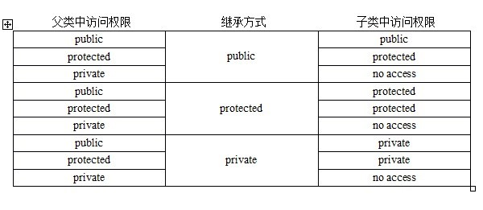

<!-- GFM-TOC -->

* [类成员的权限](#类成员的权限)
  * [访问权限](#访问权限)
  * [继承权限](#继承权限)
* [struct和class](#struct和class)
* [类内定义引用数据成员](#类内定义引用数据成员)

<!-- GFM-TOC -->

# 类成员的权限

## 访问权限

C++通过 public、protected、private 三个关键字来控制成员变量和成员函数的访问权限，它们分别表示公有的、受保护的、私有的，被称为成员访问限定符。在**类的内部没有访问权限的限制**，无论成员被声明为 public、protected 还是 private，都可以互相访问。在类的外部（定义类的代码之外），只能通过对象访问成员，并且通过对象只能访问 **public** 属性的成员，不能访问 private、protected 属性的成员

## 继承权限

# struct和class

在 C++中，可以用 struct 和 class 定义类，都可以继承。

区别在于：

1. struct 的默认继承权限和默认访问权限是 public，而 class 的默认继承权限和默认访问权限是 private。
2. class 还可以定义**模板类形参**，比如 `template <class T, int i>`。

# 类内定义引用数据成员

C++可以类内定义引用数据成员，必须通过**成员函数初始化列表**初始化。

