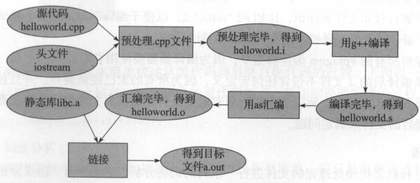

# 目录

<!-- GFM-TOC -->

* [源文件从文本到可执行文件](#源文件从文本到可执行文件)
* [include头文件](#include头文件)
* [malloc原理](#malloc原理)
* [new/delete与malloc/free](#new/delete与malloc/free)
* [内存管理](#内存管理)
  * [栈空间](#栈空间)
* [内存泄漏](#内存泄漏)
  * [分类](#分类)
  * [解决办法](#解决办法)
* [段错误](#段错误)
* [共享内存相关api](#共享内存相关api)
* [IO模型](#IO模型)
  * [1、阻塞式IO](#1阻塞式IO)
  * [2、非阻塞式IO](#2非阻塞式IO)
  * [3、多路复用IO](#3多路复用IO)
* [reactor模型](#reactor模型)
* [单线程处理高并发](#单线程处理高并发)
* [STL内存优化](#STL内存优化)
  * [1、二级内存配置器](#1二级内存配置器)
  * [2、配置函数](#2配置函数)

<!-- GFM-TOC -->


# 源文件从文本到可执行文件

对于 C++源文件，从文本到可执行文件一般需要四个过程：

1. **预处理**阶段：对源代码文件中文件包含关系（头文件）、预编译语句（宏定义）进行分析和替换，生成**预编译文件**(.i)；
2. **编译**阶段：将经过预处理后的预编译文件转换成特定**汇编代码**，生成**汇编文件**(.s) 。
3. **汇编**阶段：将编译阶段生成的汇编文件转化成**机器码**，生成**可重定位目标文件**(.o)；
4. **链接**阶段：将多个**目标文件**及所需要的**库**连接成最终的**可执行目标文件**(.out)。



源代码(.cpp) => 预处理(g++ -E -o) => 预编译文件(.i) => 编译器(g++ -S) => 汇编程序(.s) => 汇编器(as) => 可重定位目标程序(.o) => 链接器(1d) => 可执行目标程序(.out)

命令：

1. 预处理：g++ -E hello.cpp -o hello.i
2. 编译：g++ -S hello.i -o hello.s  // 运行到.s
3. 运行 g++ -C hello.cpp  // 直接运行到.o 


# include头文件

## Include 头文件的顺序

对于 include 的头文件来说，如果在文件 a.h 中声明一个在文件 b.h中定义的变量，而不引用 b.h。那么要在 a.cpp 文件中引用 b.h 文件，并且要先引用 b.h，后引用a.h，否则汇报变量类型未声明错误。

## 双引号和尖括号的区别

编译器预处理阶段查找头文件的**路径**不一样。

使用双引号包含的头文件，多为自己编写的头文件。查找头文件路径的顺序为：

1. **当前头文件目录**
2. **编译器设置**的头文件路径（编译器可使用-I 显式指定搜索路径）
3. 系统变量 CPLUS_INCLUDE_PATH/C_INCLUDE_PATH (c plus include path / c include path) 指定的头文件路径

使用尖括号包含的头文件，多为系统头文件，查找头文件的路径顺序为：

1. 编译器设置的头文件路径（编译器可使用-I 显式指定搜索路径）
2. 系统变量 CPLUS_INCLUDE_PATH / C_INCLUDE_PATH (c plus include path / c include path) 指定的头文件路径


# malloc原理

Malloc 函数用于**动态分配内存**。为了减少内存碎片和系统调用的开销，malloc 其采用内存池的方式，先申请大块内存作为堆区，然后将堆区分为多个内存块，以块作为内存管理的基本单位。当用户申请内存时，直接从堆区分配一块合适的空闲块。Malloc 采用隐式**链表结构**将堆区分成连续的、大小不一的**块**，包含已分配块和未分配块；同时 malloc 采用**显示链表**结构来管理所有的**空闲块**，即使用一个**双向链表将空闲块连接**起来，每一个空闲块记录了一个连续的、未分配的地址。

当进行内存分配时，Malloc 会通过隐式链表遍历所有的空闲块，选择满足要求的块进行分配；当进行**内存合并**时，malloc 采用**边界标记法**，根据每个块的前后块是否已经分配来决定是否进行块合并。

Malloc 在申请内存时，一般会通过 brk 或者 mmap 系统调用进行申请。其中当申请内存小于128K 时，会使用系统函数 **brk** 在**堆区**中分配；而当申请内存大于 128K 时，会使用系统函数 **mmap**在**映射区**分配。


# new/delete与malloc/free

1、new/delete 是C++的操作符，可以重载，不需要头文件支持；而malloc/free是C语言的库函数，需要头文件库函数支持。

2、new做两件事，一是分配内存，二是调用类的**构造函数**；同样，delete会调用类的**析构函数**和释放内存。而malloc和free只是分配和释放内存，必须指明申请内存空间的大小，不会调用构造函数和析构函数。

3、new建立的是一个对象，返回的是指向对象的指针，如果分配失败了会抛出 `std::bad_alloc`的异常；而malloc分配的是一块内存，返回的是无类型指针 void * ，因此 malloc 的返回值一般都需要进行类型转化，失败了会返回 NULL。

4、new 分配内存按照数据类型进行分配；malloc 分配内存按照指定的大小分配，分配的内存不够的时候，可以用 realloc 扩容。

5、new建立的对象可以用**成员函数访问**，不要直接访问它的地址空间；malloc分配的是一块内存区域，用**指针访问**，可以在里面移动指针。

6、申请数组时： new[]一次分配所有内存，多次调用构造函数，搭配使用 delete[]，delete[]多次调用析构函数，销毁数组中的每个对象。而 malloc 则只能 sizeof(int) * n。

## realloc 扩容

1.如果当前**连续内存块**足够 realloc 的话，只是将p所指向的空间扩大，并返回p的指针地址。 这个时候 q 和 p 指向的地址是一样的。

2.如果当前连续内存块不够长度，再找一个足够长的地方，分配一块新的内存q，并将 p指向的内容 copy到 q，返回 q。并将p所指向的内存空间删除。

```c++
char* p = malloc(1024);
char* q = realloc(p,2048);
```


# 内存管理

在 C++中，虚拟内存分为代码段、数据段、BSS 段、堆区、文件映射区以及栈区六部分。

## 1、栈区

**栈(stack)**：程序**自动分配**，使用栈空间存储函数的返回地址、参数、局部变量、返回值。栈区是从高地址位向低地址位增长的 ， 是一块**连续**的内存区域 ，最大容量是由系统预先定义好的 ， 申请的栈空间超过这个界限时会提示溢出。

## 2、堆区

**堆(heap)**：低地址位向高地址位增长，采用**链式存储**结构。频繁的 `malloc/free` 造成内存空间的不连续，会产生碎片。当申请堆空间时库函数是按照一定的算法搜索可用的足够大的空间。因此堆的效率比栈要低。

- **堆**：调用`malloc` 在堆区动态分配内存，调用 `free` 来手动释放。堆是**操作系统所维护**的一块特殊内存，它提供了动态分配的功能。
- **自由存储区**：由`new` 分配内存，用来 `delete` 手动释放。和堆类似，通过`new`来申请的内存区域可称为自由存储区。

## 3、静态全局区

**静态/全局区**：在 C++ 里面没有区分bss和data。

- **bss段**：存储**未初始化**的全局变量和静态变量（局部+全局），以及所有被**初始化为0**的全局变量和静态变量，Block Started by Symbol。内容并不存放在磁盘上的程序文件中，不占用可执行文件的大小，是由链接器来获取内存的。
- **data段**：存储程序中**已初始化**的全局变量和静态变量。在编译时已经分配了空间，放在程序文件中。

## 4、代码区

**代码区**（code segment 或 text segment）：

大小在程序运行前就已经确定，并且内存区域属于只读。text 段又可以分为

- **代码段**：存放函数体的二进制代码，**text**段。
- **常量区**：只读数据，比如字符串常量，程序结束时由系统释放。**rodata段**，read only。

## 5、映射区

**映射区**：memory mapping segment，存储**动态链接库**等文件映射、申请大内存（malloc 时调用 mmap 函数）


32bitCPU 可寻址 4G 线性空间，每个进程都有各自独立的 4G 逻辑地址，其中 0~3G 是**用户态**空间，3~4G 是**内核**空间，不同进程相同的逻辑地址会映射到不同的物理地址中。其逻辑地址其划分如下：

## 栈空间

C++函数栈空间的最大值默认是 1M，不过可以调整。


# 内存泄漏

内存泄漏(memory leak)是指由于疏忽或错误造成了程序未能释放掉不再使用的内存的情况。内存泄漏并非指内存在物理上的消失，而是应用程序分配某段内存后，由于设计错误，失去了对该段内存的控制，因而造成了内存的浪费。

## 分类

### 1.堆内存泄漏（Heap leak）

对内存指的是程序运行中根据需要分配通过 **malloc/new** 等从堆中分配的一块内存，再是完成后必须通过调用对应的 **free/delete** 删掉。如果程序的设计的错误导致这部分内存没有被释放，那么此后这块内存将不会被使用，就会产生 Heap Leak。

解决办法：为了判断内存是否泄露，我们一方面可以使用 linux 环境下的**内存泄漏检查工具 Valgrind**，另一方面我们在写代码时可以添加内存申请和释放的**统计功能**，统计当前申请和释放的内存是否一致，以此来判断内存是否泄露。

### 2.系统资源泄露（Resource Leak）

主要指程序使用**系统分配的资源**比如 bitmap，handle，socket 等没有使用相应的函数释放掉，导致系统资源的浪费，严重可导致系统效能降低，系统运行不稳定。

### 3.没有将基类的析构函数定义为虚函数

当基类指针指向子类对象时，如果基类的析构函数不是 virtual，那么子类的析构函数将不会被调用，子类的资源没有正确是释放，因此造成内存泄露。


## 解决办法

### 1、valgrind

（1）Valid-value表

对于进程的整个地址空间中的每一字节(byte),都有与之对应的8个bits，对于CPU的每个寄存器，也有一个与之对应的bit向量。这些bits负责记录该字节或者寄存器值是否具有有效 的、已经初始化的值。

（2）Valid-Address表

对于进程整个地址空间中的 么一个字节（byte),还有与 之对应的1bit，负责记录该地址是否能够被读写。

（3）检测原理

当要读写内存中的某个字节时，首先检查这个字节对应的A bit。如果该A bit显示该位置是无效位置，memcheck则报告读写错误。

内核（core）类似于 一个虚拟的CPU的环境，这样当内存中的某个字节被加载到真实的CPU中时，该字节对应的V bit也被加载到虚拟的CPU环境中，一旦寄存器中的值，被用来产生内存地址，或者该值能够影响程序 的输出，则memcheck会检查对应的vbits，如果该值尚未初始化，则会报告使用未初始化内存错误。


### 2、mtrace

```c++
#include <mcheck.h>
void mtrace(void);
void muntrace(void);
```

`mtrace` 用于开启内存使用记录，`muntrace`用于取消内存使用记录。内存使用情况记录到一个文件，值由环境变量：`MALLOC_TRACE`决定。


# 段错误

段错误通常发生在**访问非法内存**地址的时候，具体来说分为以下几种情况：

1. 使用野指针
2. 试图修改字符串常量的内容

野指针就是指向一个**已删除的对象**或者**未申请访问受限内存区域**的指针


# 共享内存相关api

Linux 允许不同进程访问同一个逻辑内存，提供了一组 API，头文件在 sys/shm.h 中。

## 1.新建共享内存shmget

```c++
int shmget(key_t key,size_t size,int shmflg);
```

- key：共享内存键值，可以理解为共享内存的唯一性标记。
- size：共享内存大小
- shmflag：创建进程和其他进程的读写权限标识。
- 返回值：相应的共享内存标识符，失败返回-1

## 2.连接共享内存到当前进程的地址空间shmat

```c++
void *shmat(int shm_id,const void *shm_addr,int shmflg);
```

- shm_id：共享内存标识符
- shm_addr：指定共享内存连接到当前进程的地址，通常为 0，表示由系统来选择。
- shmflg：标志位
- 返回值：指向共享内存第一个字节的指针，失败返回-1

## 3.当前进程分离共享内存shmdt

```c++
int shmdt(const void *shmaddr);
```

## 4.控制共享内存shmctl

和信号量的 semctl 函数类似，控制共享内存

```c++
int shmctl(int shm_id,int command,struct shmid_ds *buf);
```

- shm_id：共享内存标识符
- command: 有三个值
- IPC_STAT:获取共享内存的状态，把共享内存的 shmid_ds 结构复制到 buf 中。
- IPC_SET:设置共享内存的状态，把 buf 复制到共享内存的 shmid_ds 结构。
- IPC_RMID:删除共享内存
- buf：共享内存管理结构体。


# IO模型

## 1、阻塞式IO

在阻塞式I/O模型中，对每个连接套接字通过轮流read系统调用获取可读数据。read系统调用将会把该线程阻塞，直到数据报到达且被复制到应用进程的缓冲区中时才会返回。在阻塞式I/O模型中，数据可读和读取数据这两个操作被合并在了一个系统调用中，对于单个套接字是否可读的判断，必须要等到实际数据接收完成才行，阻塞耗时是不确定的。


## 2、非阻塞式IO

在非阻塞I/O模型中，虽然数据可读和读取数据这两个操作依旧在一个系统调用中，但是如果没有数据可读，系统调用将**立即返回**。此时我们可以对多个连接套接字**轮流调用read**，直到某次调用收到了实际数据，我们才针对这次收到的数据进行处理，可以初步解决服务器同时读取多个客户数据的问题。但是这种在一个线程内对多个非阻塞描述符循环调用read的方式，我们称之为**轮询**。应用持续轮询内核，以查看某个操作是否就绪，这往往会消耗大量CPU时间，同时也会给整个服务器带来极大的额外开销。


## 3、多路复用IO

**多线程**支持，即thread-per-connection方案。在该方案中，服务器会给每个连接客户分配一个线程，每个连接的读写都是在一个单独的线程中进行。因此对一个客户线程内的套接字进行读取操作，最多只会阻塞该客户线程，而不会对其他线程的其他连接产生影响。这是Java网络编程常见方案。这种方式中线程创建和销毁的开销较大，因此并不适合可能会频繁连接和断开的短连接服务，当然频繁的线程创建和销毁可以通过线程池进行改良。同时这种方案的伸缩性同样受到线程数的限制，会对操作系统的调度程序产生极大的负担，也会对内存大小提出很高的要求。


# reactor模型

reactor 模型要求**主线程只负责监听文件描述上是否有事件发生**，有的话就立即将该事件通知工作线程，除此之外，主线程不做任何其他实质性的工作，读写数据、接受新的连接以及处理客户请求均在工作线程中完成。

**Reactor 是一种处理模式。** Reactor 模式是处理并发 I/O 比较常见的一种模式，用于同步 I/O，中心思想是将所有要处理的IO事件注册到一个中心 I/O 多路复用器上，同时主线程/进程阻塞在多路复用器上；一旦有 I/O 事件到来或是准备就绪(文件描述符或 socket 可读、写)，多路复用器**返回并将事先注册的相应 I/O 事件分发**到对应的处理器中。

其模型组成如下：


1.事件源（Handle）：：由操作系统提供，用于**识别每一个事件**，如Socket描述符、文件描述符等。在服务端系统中用一个整数表示。该事件可能来自外部，如来自客户端的连接请求、数据等。也可能来自内部，如定时器事件。由于 Reactor 模式一般使用在网络编程中，因而这里一般指 Socket Handle，即一个网络连接。

2.同步事件复用器（Synchronous Event Demultiplexer）：**阻塞等待**一系列的 Handle 中的事件到来，直到复用器的描述符集上有事件发生，如果阻塞等待返回，即表示在返回的 Handle 中可以不阻塞的执行返回的事件类型。这个模块一般使用操作系统的 select 来实现。

3.启动调度程序（Initiation Dispatcher）：用于**管理 Event Handler** ，即 Event Handler 的容器，用以注册、移除 Event Handler 等；另外，它还作为 Reactor 模式的入口调用同步事件复用器的 select 方法以阻塞等待事件返回，当阻塞等待返回时，根据事件发生的 Handle 将其分发给对应的 Event Handler ，即回调 Event Handler 中的 `handle_event()` 方法。

4.事件处理器（Event Handler）：定义事件处理方法 `handle_event()`，事件处理程序提供了一组**接口**，每个接口对应了一种类型的事件，以供 Initiation Dispatcher 回调使用。

5.具体事件处理器（Concrete Event Handler）：事件 Event Handler 接口，实现特定事件处理逻辑。


# 单线程处理高并发

在单线程模型中，可以采用 **I/O 复用(select/poll/epoll)**来提高单线程**处理多个请求**的能力，然后再采用**事件驱动**模型。

使用 **select** 或者 **poll** 等待数据，并且可以等待**多个套接字(Socket)中的任何一个变为可读**。这一过程会被**阻塞**，当某一个套接字可读时返回，之后再使用 **recvfrom** 把数据从内核复制到进程中。它可以让**单个进程具有处理多个 I/O 事件的能力**。又被称为 Event Driven I/O，即**事件驱动 I/O**。


# STL内存优化

## 1、二级内存配置器

STL 内存管理使用二级内存配置器。

### （1）第一级配置器

第一级配置器以 malloc()，free()，realloc() 等 C 函数执行实际的内存**配置、释放、重新配置**等操作，并且能在内存需求不被满足的时候，调用一个指定的函数。一级空间配置器分配的是**大于 128 bytes**的空间。如果分配不成功，调用句柄释放一部分内存；如果还不能分配成功，抛出异常。

### （2）第二级配置器

在 STL 的第二级配置器中多了一些机制，避免太多小区块造成的内存碎片，小额区块带来的不仅是内存碎片，配置时还有额外的负担。区块越小，额外负担所占比例就越大。

### （3）分配原则

如果要分配的区块**大于 128 bytes**，则移交给第一级配置器处理。

如果要分配的区块**小于 128 bytes**，则以内存池管理（memory pool），又称之次层配置（sub-allocation）：每次配置一大块内存，并维护对应的 16 个**空闲链表**（free-list）分别管理大小为8、16、24......120、128 的数据块。下次若有相同大小的内存需求，则直接从 free-list 中取。如果有小额区块被释放，则由配置器回收到 free-list 中。


当用户申请的空间小于 128 字节时，将字节数扩展到 8 的倍数，然后在自由链表中查找对应大小的子链表。

- 如果在自由链表查找不到或者块数不够，则向内存池进行申请，一般一次申请 20 块该大小的空间；

- 如果内存池空间足够，则取出内存；
- 如果不够分配 20 块，则分配最多的块数给自由链表，并且更新每次申请的块数；
- 如果一块都无法提供，则把剩余的内存挂到自由链表，然后用 `malloc` 向系统 heap 申请空间；
- 如果整个系统的堆空间都不够用了，`malloc` 失败，则看看自由链表还有没有可用的块；
- 如果也没有，则最后调用一级空间配置器。

## 2、配置函数

### （1）空间配置函数 allocate

首先先要检查申请空间的大小，如果大于 128 字节就调用第一级配置器，使用 `malloc`；

小于 128 字节就检查对应的空闲链表。如果该空闲链表中有可用数据块，则直接拿来用（拿取空闲链表中的第一个可用数据块，然后把该空闲链表的地址设置为该数据块指向的下一个地址）；如果没有可用数据块，则调用 `refill` 重新填充空间。

### （2）空间释放函数 deallocate

首先先要检查释放数据块的大小，如果大于 128 字节就调用第一级配置器，使用`free`；

小于 128 字节则根据数据块的大小来判断回收后的空间会被插入到哪个空闲链表。

### （3）重新填充空闲链表 refill

在用 `allocate` 配置空间时，如果空闲链表中没有可用数据块，就会调用 `refill` 来重新填充空间，新的空间取自内存池。缺省取 20 个该大小的数据块，如果内存池空间不足，那么能取多少个节点就取多少个。

从内存池取空间给空闲链表用是 `chunk_alloc` 函数，首先根据 end_free - start_free 来判断内存池中的剩余空间是否足以调出 20 个大小为 size 的数据块出去，如果内存连一个数据块的空间都无法供应，需要用 `malloc` 取堆中申请内存。假如整个系统的堆空间都不够用了，`malloc` 失败，那么 `chunk_alloc` 会从空闲链表中找是否有大的数据块，然后将该数据块的空间分给内存池（这个数据块会从链表中去除）。


