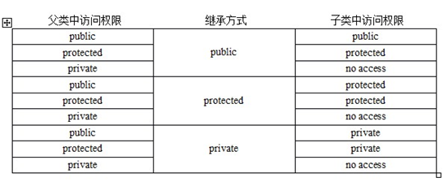

<!-- GFM-TOC -->

* [类的三大特性](#类的三大特性)
  * [1、封装](#1封装)
  * [2、继承](#2继承)
  * [3、多态](#3多态)
* [类成员的权限](#类成员的权限)
  * [访问权限](#访问权限)
  * [继承权限](#继承权限)
* [struct和class](#struct和class)
* [类内定义引用数据成员](#类内定义引用数据成员)
* [引用折叠](#引用折叠)
* [左值和右值](#左值和右值)
* [右值引用](#右值引用)
  * [1移动语意](#1移动语意)
  * [2完美转发](#2完美转发)
* [析构函数](#析构函数)
  * [类析构顺序](#类析构顺序)
* [虚函数](#虚函数)
  * [1多态和虚函数](#1多态和虚函数)
  * [2析构函数和虚函数](#2析构函数和虚函数)
  * [3静态函数和虚函数](#3静态函数和虚函数)
* [可变参数模板](#可变参数模板)
* [类图](#类图)
  * [泛化关系 (Generalization)](#泛化关系-generalization)
  * [实现关系 (Realization)](#实现关系-realization)
  * [聚合关系 (Aggregation)](#聚合关系-aggregation)
  * [组合关系 (Composition)](#组合关系-composition)
  * [关联关系 (Association)](#关联关系-association)
  * [依赖关系 (Dependency)](#依赖关系-dependency)
* [设计原则](#设计原则)
  * [S.O.L.I.D](#solid)
  * [其他常见原则](#其他常见原则)

<!-- GFM-TOC -->


# 类的三大特性

面向对象编程的主要思想是把构成问题的各个事务分解成各个对象，建立对象的目的不是为了完成一个步骤，而是为了描述一个事物在解决问题中经过的步骤和行为。类是创建对象的一个模板。

## 1、封装

定义：封装就是将抽象得到的**数据和程序**相结合，形成一个有机的整体，也就是将数据与操作数据的源代码进行有机的结合，**形成类**，其中**数据和函数都是类的成员**，目的在于将对象的使用者和设计者分开，以提高软件的可维护性和可修改性

### 构造函数

数据成员是不能在类中初始化的，而构造函数，正是为此而生，主要用来处理数据成员的初始化。它不需要用户调用，而是在建立对象时自动执行的。

## 2、继承

定义：继承就是**新类从已有类那里得到已有的特性**。 **类的派生**指的是从已有类产生新类的过程。原有的类成为基类或父类，产生的新类称为派生类或子类，子类继承父类后，可以**创建子类对象来调用父类函数，变量**等。

### （1）继承方式

（1.1）单一继承：继承一个父类，这种继承称为单一继承，一般情况尽量使用单一继承，使用多重继承容易造成混乱易出问题

（1.2）多重继承：**继承多个父类**，类与类之间要用逗号隔开，类名之前要有继承权限，假使两个或两个基类都有某变量或函数，在子类中调用时需要加类名限定符如c.a::i = 1；

（1.3）菱形继承：多重继承掺杂隔代继承1-n-1模式，此时需要用到**虚继承**，例如 B，C虚拟继承于A，D再多重继承B，C，否则会出错

继承权限：继承方式规定了如何访问继承的基类的成员。继承方式指定了派生类成员以及类外对象对于从基类继承来的成员的访问权限。继承可以扩展已存在的代码，目的也是为了代码重用。继承也分为接口继承和实现继承：

### （2）三种访问权限：

- public：可以被任意实体访问

- protected：只允许本类和子类的成员函数访问

- private：只允许本类的成员函数访问


访问权限图如下：



### （3）存储

父类所有的非静态成员属性都会被继承下去（占用空间），只是private属性被隐藏了。

### （4）访问

访问子类同名成员，直接访问即可；**访问父类同名成员，需要加作用域**。对于成员函数，即使子类和父类发生重载，访问父类也必须加作用域。同名静态成员处理方式和非静态处理方式一样，只不过有两种访问的方式（**通过对象**和**通过类名**）。

```c++
void test01()
{
  //通过对象访问
  cout << "通过对象访问： " << endl;
  Son s;
  cout << "Son 下 m_A = " << s.m_A << endl;
  cout << "Base 下 m_A = " << s.Base::m_A << endl;
    
  //通过类名访问
  cout << "通过类名访问： " << endl;
  cout << "Son 下 m_A = " << Son::m_A << endl;
  cout << "Base 下 m_A = " << Son::Base::m_A << endl;
}
```


## 3、多态

多态简单的说就是“**一个函数，多种实现**”，是指相同的操作或函数、过程可作用于多种类型的对象上并获得不同的结果。

C++多态分为**静态多态**和**动态多态**。

- 静态多态是通过**重载**和**函数模板**技术实现，在**编译**的时候确定。

- 动态多态通过**虚函数**和**继承**关系来实现，执行动态绑定，在**运行**的时候确定。

### 1、静态多态

是在**编译期**就把函数链接起来，此时即可确定调用哪个函数或模板，静态多态是由**重载**和**函数模板**实现的，在宏多态中，是通过定义变量，编译时直接把变量替换，实现宏多态。

优点：带来了泛型编程的概念，使得C++拥有泛型编程与STL这样的武器； 在编译期完成多态，**提高运行期效率**；具有很强的适配性和松耦合性，（耦合性指的是两个功能模块之间的依赖关系）

缺点： 程序可读性降低，代码调试带来困难；**无法实现模板的分离编译**，当工程很大时，编译时间不可小觑 ；无法处理异质对象集合

#### （1）重载

```c++
void print(int a ,int b);// 重载print()函数
void print(const char* str);
 
print(2,5);  //调用重载函数
print("def");

void print(const char* str,int width);// 错误，这不是重载
int print(const char* str,int width); 
```

#### （2）函数模板

函数模板是通用的函数描述，使用**泛型**来定义函数，其中泛型可用具体的类型（int 、double等）替换。

```c++
// 交换两个值，但是不清楚是int 还是 double，如果不使用模板，则要写两份代码
// 使用函数模板，将类型作为参数传递
template<class T>
class Swa(T a,T b)
{
    T temp;
    temp = a;
    a = b;
    b = temp;
};
```


### 2、动态多态

动态多态是指在程序**运行**时才能确定函数和实现的链接，此时才能确定调用哪个函数，基类指针或者引用能够指向派生类对象，调用派生类的函数，所以在编译时是无法确定调用哪个函数。

动态多态是由**虚指针**和**虚表**实现的。

对于有虚函数的类，编译器都会维护一张虚函数表(**虚表**)，虚函数表中列出了该类的全部虚函数地址。该类的对象的前四个字节就是指向虚表的指针(**虚指针**)。派生类从基类继承了虚表，如果派生类重写了其中的某个虚函数，那么虚表中该函数的地址就会被替换。

使用时在基类中写一个虚函数，在派生类中重写，用基类指针调用这个虚函数，就会去查找虚表中该函数的地址，实际上会调用**派生类重写的虚函数**。

通过基类的引用或指针调用，调用基类还是派生类的虚函数，要根据运行时根据指针或引用**实际指向或引用的类型**确定；调用非虚函数时，则无论基类指向的是何种类型，都调用基类的函数。

#### （1）虚函数和纯虚函数

用 `virtual` 声明虚函数。

在多态中，通常父类中虚函数的实现是毫无意义的，主要都是调用子类重写的内容。因此可以将虚函数改为纯虚函数。在基类中实现纯虚函数的方法是在函数原型后加 `=0` 。 类中只要有了纯虚函数，就是**抽象类**。

抽象类特点：

1. 无法实例化对象，只能构建指针指向对象；
2. 子类必须重写抽象类中的纯虚函数，否则也属于抽象类。

```c++
class Base
{   
public :
    virtual void func() = 0;                           //纯虚函数 
    virtual void func(int a) { cout <<"Base" << endl;} //基类虚函数（虚函数只要定义一次即可）
};
class Child : public Base
{
public :
    virtual void func( int a) { cout <<"Child" << endl;} //派生类的虚函数取代了基类的虚函数
}

int main() 
{
    Base * base = new Child; //实例化派生类Child的对象，并用基类指针指向它
	base->func(); //调用派生类Child的虚函数
	delete base;  //记得销毁
	return 0;
}
```

#### （2）虚析构和纯虚析构

多态使用时，如果子类中有属性开辟到堆区，那么父类指针在释放时无法调用到子类的析构代码。解决方式：将**父类中**的析构函数改为**虚析构**或者纯虚析构。析构函数加上 `virtual` 关键字，变成虚析构函数。纯虚析构函数的方法是在函数原型后加 `=0` 。

- 虚析构和纯虚析构共性：可以解决**父类指针释放子类对象**；都需要有具体的**函数实现**。
- 虚析构和纯虚析构区别：如果是纯虚析构，该类属于抽象类，无法实例化对象。

语法：

- 虚析构：`virtual ~类名(){}`
- 纯虚析构：` virtual ~类名() = 0;`、`类名::~类名(){}`


```c++
class Base 
{
public:
	Base()  {	cout << "构造函数" << endl;}
	virtual void Speak() = 0; //虚函数    
	virtual ~Base()	{ cout << "虚析构函数" << endl;} // 虚析构函数
	virtual ~Base() = 0;                             // 纯虚析构函数
};
Base::~Base() { cout << "纯虚析构函数" << endl;}          // 纯虚析构函数

class Child : public Base 
{
public:
	Child(string name)	{ cout << "构造函数" << endl;}
	virtual void Speak()	{ cout << "派生类重写虚函数" << endl;}
	~Child()	{ cout << "析构函数" << endl;	}
};

int main() 
{
    Base *base = new Child;
	base->Speak();

	//通过父类指针去释放，会导致子类对象可能清理不干净，造成内存泄漏
	//给基类增加一个虚析构函数，虚析构函数就是用来解决通过父类指针释放子类对象
	delete base;
	return 0;
}
```


# 类成员的权限

## 访问权限

C++通过 public、protected、private 三个关键字来控制成员变量和成员函数的访问权限，它们分别表示公有的、受保护的、私有的，被称为成员访问限定符。在**类的内部没有访问权限的限制**，无论成员被声明为 public、protected 还是 private，都可以互相访问。在类的外部（定义类的代码之外），只能通过对象访问成员，并且通过对象只能访问 **public** 属性的成员，不能访问 private、protected 属性的成员

## 继承权限


# struct和class

在 C++中，可以用 struct 和 class 定义类，都可以继承。

区别在于：

1. struct 的默认继承权限和默认访问权限是 public，而 class 的默认继承权限和默认访问权限是 private。
2. class 还可以定义**模板类形参**，比如 `template <class T, int i>`。


# 类内定义引用数据成员

C++可以类内定义引用数据成员，必须通过**成员函数初始化列表**初始化。


# 左值和右值

## 概念

1. 左值(lvalue)：能对表达式取地址、或具名对象/变量。一般指表达式结束后依然存在的**持久对象**。
2. 右值(rvalue)：不能对表达式取地址，或匿名对象。一般指表达式结束就不再存在的**临时对象**。右值包括**纯右值**和**将亡值**，纯右值主要包括**常量**，将亡值主要指**临时变量**，被const修饰的变量也是右值，只能读不能写。

## **左值**

描述：能够用&取地址、或具名对象/变量， 一般指表达式结束后依然存在的**持久对象**。

举例：

- 函数名和变量名（实际上是函数指针和具名变量，具名变量如std::cin、std::endl等）、
- 返回左值引用的函数调用、前置自增/自减运算符连接的表达式++i/--i、
- 由赋值运算符或复合赋值运算符连接的表达式(a=b、a+=b、a%=b）、
- 解引用表达式*p、
- 字符串字面值"abc"等。

## **纯右值**

满足下列条件之一：

- 本身就是赤裸裸的、纯粹的**字面值**，如3、false（字符串字面值例外，是左值）；
- 求值结果相当于字面值或是一个不具名的**临时对象**。

举例：

- 除字符串字面值以外的字面值；
- 返回非引用类型的函数调用；
- 后置自增/自减运算符连接的表达式i++/i--；
- 算术表达式（a+b、a&b、a<<b）、逻辑表达式（a&&b、a||b、~a）、比较表达式（a==b、a>=b、a<b）；
- 取地址表达式（&a）等。


## **将亡值**

“将亡值”概念的产生，是由右值引用的产生而引起的。将亡值表达式：

- **返回右值引用的函数**的调用表达式
- **转换为右值引用的函数**的调用表达式

上面两种表达式的结果都是**不具名的右值引用（是右值）**。在C++11中，我们用左值去初始化一个对象或为一个已有对象赋值时，会调用**拷贝构造函数**或**拷贝赋值运算符**来拷贝new出来的对象，而当我们用一个右值（纯右值和将亡值）来初始化或赋值时，会调用**移动构造函数**或**移动赋值运算符**来移动资源，从而避免拷贝，提高效率。

当该右值完成初始化或赋值的任务时，它的资源已经移动给了被初始化者或被赋值者，同时该右值也将会马上被销毁（析构）。即当一个右值准备完成初始化或赋值任务时，它已经“将亡”了。

举例来说，`std::move()`、`static_cast()`这两个函数常用来将左值强制转换成右值，从而使拷贝变成移动，提高效率。


## 区别

区别：

1. 左值可以**寻址**，而右值不可以。
2. 左值可以被**赋值**，右值不可以被赋值，可以用来给左值赋值。
3. 左值**可变**，右值不可变（仅对基础类型适用，用户自定义类型右值引用可以通过成员函数改变）。
4. 当对象被用作左值的时候，用的是对象的在内存中的**位置**；当一个对象被用作右值的时候，用的是对象的值。

下面从上面的例子中选取若干典型详细说明左值和纯右值的判断。

**（1）++i是左值，i++是右值**

`++i`对i加1后再赋给i，最终的返回值就是i，所以，++i的结果是具名的，名字就是i；而对于`i++`而言，是先对i进行一次拷贝，将得到的副本作为返回结果，然后再对i加1，由于`i++`的结果是对i加1前i的一份拷贝，所以它是不具名的。

**（2）解引用表达式\*p是左值，取地址表达式&a是纯右值**

`&(*p)`一定是正确的，因为`*p`得到的是p指向的**实体**，`&(*p)`得到的就是这一实体的地址，正是p的值。由于`&(*p)`的正确，所以`*p`是左值。而对`&a`而言，得到的是a的地址，相当于unsigned int型的**字面值**，所以是纯右值。

**（3）a+b、a&&b、a==b都是纯右值**

`a+b`得到的是不具名的临时对象，而`a&&b`和`a==b`的结果非true即false，相当于字面值。

**（4）字符串字面值是左值。**

不是所有的字面值都是纯右值，字符串字面值是唯一例外。 早期C++将字符串字面值实现为char型数组，实实在在地为**每个字符都分配了空间**并且允许程序员对其进行操作，所以类似

```c++
cout << &("abc") << endl; //可以直接对字符串取地址&
char *p_char = "abc";  //注意不是char *p_char=&("abc");
```

这样的代码都是可以编译通过的。 注意上面代码中的注释，"abc"可以直接初始化指针 p_char，p_char 的值为字符串"abc"的首字符a的地址。

**（5）具名的右值引用是左值，不具名的右值引用是右值。**

```c++
struct X {};
X a;
X&& b = static_cast<X&&>(a);
X&& c = std::move(a);
// static_cast<X&&>(a) 和 std::move(a) 是不具名右值引用，是右值
// b 和 c 是具名右值引用，是左值

X& d = a;
X& e = b; //左值引用d和e只能绑定左值（包括普通左值a、具名右值引用b）

X&& h = X();//右值引用b、c、h只能绑定右值（包括不具名右值引用std::move(a)，临时对象X()）

const X& f = c;
const X& g = X();//const左值引用f和g可以绑定左值（右值引用c），也可以绑定右值（临时对象X()）
```


# 右值引用

普通引用称为左值引用(lvalue reference)，右值引用(rvalue reference)是 C++11 中引入的新特性 , 使用的符号是`&&`。右值引用实质上就是将不具名变量取了个别名，**具名右值引用本质是左值**。

左值引用只能绑定左值，右值引用只能绑定右值，否则编译就会失败。const左值引用可以绑定非常量左值、常量左值、右值，而且在绑定右值的时候，const左值引用还可以像右值引用一样将右值的生命期延长，缺点是，只能读不能改。

```c++
int& a = 1; //编译错误! 1是右值，不能够使用左值引用
int&& a = 1; //正确，右值引用实质上就是将不具名(匿名)变量取了个别名
int b = 1;
int && c = b; //编译错误！ 不能将一个左值复制给一个右值引用
int && c = std::move(b);  //正确，使用move移动语意，转换左值为右值引用

class A {
  public:
    int a;
};
A getTemp()
{
    return A();
}
A && a = getTemp();   //getTemp()的返回值是右值（临时变量）
```

`getTemp()`返回的右值本来在表达式语句结束后，其生命也就该终结了（因为是临时变量）。而通过右值引用，其生命期将与右值引用类型变量`a`的生命期一样，只要`a`还活着，该右值临时变量将会一直存活下去。实际上就是给那个临时变量取了个名字。

右值引用实现了**移动语义**和**完美转发**。使用：

`std::move(a) `将左值 a 转化为右值；

`std::forward(a)` 将右值引用 a 转化为右值。

## 1、移动语意

移动语意(`std::move`)，可以将左值转化为右值引用。消除**两个对象交互**时不必要的对象拷贝，节省运算存储资源，提高效率。

对于一个包含指针成员变量的类，由于编译器默认的拷贝构造函数都是浅拷贝，所有我们一般需要通过实现深拷贝的拷贝构造函数，为指针成员分配新的内存并进行内容拷贝。

```c++
class myVector 
{
    int size;
    double* array;
public:
    // 拷贝构造函数（深拷贝）
    myVector(const myVector& rhs) 
    {  
        size = rhs.size; 
        array = new double[size];
        for (int i=0; i<size; i++) 
            array[i] = rhs.array[i]; 
	}
};

myVector createMyVector {... }// 此函数返回值是一个 MyVector
int main() 
{
	myVector a = createMyVector(); 
    // createMyVector()返回临时变量、赋值给a 这两个过程都会调用拷贝构造函数
}
```

解决方法, 添加一个移动构造函数，那么，`myVector a = createMyVector()`就不会调用拷贝构造函数，而会调用移动构造函数。

```c++
myVector(myVector&& rhs) // 移动构造函数
{  
    size = rhs.size;  //将rhs.size和rhs.array的值给了size和array，不需要分配、释放内存
    array = rhs.array;
    rhs.size = 0; 
    rhs.array = nullptr;
}
```

## 2、完美转发

Perfect Forwarding，即完美转发，就是在参数传递过程中，值和属性（**左值／右值**）都不能改变，而不产生额外的开销。C++11是通过**引用折叠**结合新的**模板推导规则**来实现的完美转发。

### 引用折叠

引用折叠（reference collapsing），即创建**引用的引用**时（如模板参数、类型别名）会造成引用折叠，折叠规则如下（定义中出现了左值引用就折叠为左值引用）：

- T& & => T&
- T& && => T&
- T&& & => T&
- T&& && => T&&

因此，我们将转发函数和目标函数的参数都设置为右值引用类型。当传入一个左值引用时，经过引用折叠变为左值引用；当传入一个右值引用时，经过引用折叠变为右值引用。

### 模板推导

模板函数推导：当转发函数的实参是类型X的一个**左值引用**，那么模板参数被推导为**X&**类型；当转发函数的实参是类型X的一个**右值引用**，那么模板的参数被推导为**X&&**（转发引用）类型。我们不仅在参数部分使用了T&&这样的标识，在目标函数传参的强制类型转换中也使用了这样的形式。这个标识不是右值引用，它有专用的名字为转发引用（forwarding reference）。

### forword

 `std::forward`是在代码实现过程中，保持**实参**的原有的引用类型（左引用或者右引用类型）。不管传入的实参是左值还是右值，因为参数在函数内部有了名字，所以在函数内部就都变成了左值了。使用`std::forward()`函数，变量的右值属性将得到保留，实现如下：

```c++
template<class T>
T&& forward(typename remove_reference<T>::type& arg) 
{
  return static_cast<T&&>(arg);
}
```

参数转发：

```c++
class myVector {...} 
myVector createMyVector {... /*返回值是一个 MyVector*/}

void foo(myVector& v) {}
void foo(myVector&& v) {}

template<typename T>  // 参数转发
void relay(T arg) 
{
	foo(arg);
}
int main() 
{
	myVector reusable= reateMyVector();
	relay(reusable); // 拷贝构造函数
	relay(createMyVector()); // 移动构造函数
}
```

此时定义了的两个 `foo`只有 `foo(myVector& v)` 会被调用 ，因为右值引用 `myVector&& v`是个左值。

所以，我们需要改写上文的 relay 函数，借助 `std::forward`：

```c++
template<typename T>
void relay(T&& arg) 
{
    foo(std::forward<T>(arg));
}
```

于是就有：`relay(reusable)` 调用 `foo(myVector&)`；`relay(createMyVector()) `调用 `foo(myVector&&)`。实现完美转发。


# 析构函数

析构函数与构造函数对应，当对象结束其生命周期，如对象所在的函数已调用完毕时，系统会自动执行析构函数。

析构函数名也应与类名相同，只是在函数名前面加一个位取反符~，例如`~stud( )`，以区别于构造函数。它**不能带任何参数，也没有返回值**（包括 void 类型）。只能有一个析构函数，**不能重载**。

如果用户没有编写析构函数，编译系统会自动生成一个缺省的析构函数（即使自定义了析构函数，编译器也总是会为我们合成一个析构函数，并且如果自定义了析构函数，编译器在执行时会先调用自定义的析构函数再调用合成的析构函数），它也不进行任何操作。所以许多简单的类中没有用显式的析构函数。

如果一个类中有指针，且在使用的过程中动态的申请了内存，那么最好显示构造析构函数在销毁类之前，释放掉申请的内存空间，避免内存泄漏。

## 类析构顺序

1. 派生类本身的析构函数
2. 对象成员析构函数
3. 基类析构函数

因为析构函数没有参数，所以包含成员对象的类的析构函数形式上并无特殊之处。但在撤销该类对象的时候，会首先调用自己的析构函数，再调用成员对象的析构函数，调用次序与初始化时的次序相反。


# 虚函数

C++使用函数继承的方法快速实现开发，而为了满足多态与泛型编程这一性质，C++允许用户使用虚函数 **(virtual function)** 来完成 **运行时决议** 这一操作，这与一般的 **编译时决定**有着本质的区别。

当一个类中包含被virtual 关键字修饰的成员函数时，该成员函数就成为了一个**虚函数**。第一个含有虚函数的类所实例化出来的对象都拥有同一个**虚函数表**，在对象中含有一个**虚函数指针 *_vptr**，该指针指向该类的虚函数表，虚函数表保存的是**类中虚函数的地址**（一个类可能有多个虚函数），实际的虚函数在代码段(.text)中。当子类继承了父类的时候也会继承其虚函数表，当子类重写父类中虚函数时候，我们就说这两个类构成**多态**，此时会将其继承到的**虚函数表中的地址替换为重新写的函数地址**。从而基类与子类调用同名的虚函数时，所调用的就不是同一个函数，从而体现了多态和虚函数表的作用。使用了虚函数，会增加访问内存开销，降低效率。

##  1多态和虚函数

多态的实现主要分为**静态多态**和**动态多态**，**静态多态主要是重载**，在**编译的时候就已经确定**；**动态多态是用虚函数**机制实现的，在**运行期间动态绑定**。例如：一个父类类型的指针指向一个子类对象时候，使用父类的指针去调用子类中**重写**了的父类中的虚函数的时候，会调用子类重写过后的函数，在父类中声明为加了 virtual 关键字的函数，在子类中重写时候不需要加 virtual也是虚函数。

## 2析构函数和虚函数

析构函数必须是虚函数，因为将可能会被继承的父类的析构函数设置为虚函数，可以保证当我们 new 一个子类，然后使用基类指针指向该子类对象`TestFather* p = new TestChild()`，**释放基类指针时可以释放掉子类的空间**，防止内存泄漏。否则直接给编译器一个基类的指针，delete的时候，编译器一看是基类的析构函数，直接调用基类析构函数，而没有析构子类。

C++默认的析构函数不是虚函数是因为虚函数需要额外的虚函数表和虚表指针，占用额外的内存。而对于不会被继承的类来说，其析构函数如果是虚函数，就会浪费内存。因此 C++默认的析构函数不是虚函数，而是只有当需要当作**父类**时，**设置虚函数**。

## 3静态函数和虚函数

静态函数是用**static**修饰的函数，限定在本源码文件中使用，不能被本源码文件以外的代码文件调用。 普通的函数，默认是extern的，也就是说，可以被其它代码文件调用该函数。

静态函数在**编译**的时候就已经确定运行时机，虚函数在**运行**的时候动态绑定。虚函数因为用了虚函数表机制，调用的时候会增加一次内存开销。

**区别**：我们知道类的静态函数是没有this指针的，调用它时不需要创建对象，通过：类名 ：：函数名（参数）的形式直接调用。静态函数只有**唯一的**一份，因此它的**地址是固定不变的**， 所以编译的时候但凡遇到调用该静态函数的时候就知道调用的是哪一个函数，因此说**静态函数在编译的时候就已经确定运行时机。** 而虚函数则不然，看下面的代码：

```c++
class A
{
	public: 
	virtual void fun()
    {
        cout<<"i am A <<endl;
    }
}
class B: public A
{
	public:
	virtual  void  fun()
	{
        cout<<"I  am  B" <<endl;
    }
};
int main()
{
	A a ;
	B b;
	A*  pb = &b;
	pb->fun();
	return 0; 
}
```

类A与类B构成多态，创建了 A类指针pb指向 B类对象，当程序编译的时候只对语法等进行检测，该语句没有什么问题，但是编译器此时无法确定调用的是哪一个 fun() 函数，因为类A类B中都含有fun函数，因此只能是在程序运行的时候通过 pb指针查看对象的虚函数表（访问虚函数表就是所谓的访问内存）才能确定该函数的地址，即确定调用的是哪一个函数。这就解释了所说的“**虚函数在运行的时候动态绑定。虚函数因为用了虚函数表机制，调用的时候会增加一次内存开销。**”


# 可变参数模板

C++11 的可变参数模板，对参数进行了高度泛化，可以表示**任意数目、任意类型**的参数，其语法为：在 class 或 typename 后面带上省略号”。例如：

```c++
Template<class ... T>
void func(T ... args)
{
	cout<<”num is”<<sizeof ...(args)<<endl;
}
func();     //args 不含任何参数
func(1);    //args 包含一个 int 类型的实参
func(1,2.0) //args 包含一个 int 一个 double 类型的实参
```

其中 T 叫做**模板参数包**，args 叫做**函数参数包**

省略号作用如下：

- 声明一个包含 0 到任意个模板参数的参数包

- 在模板定义的右边，可以将参数包展成一个个独立的参数


C++11 可以使用**递归函数**的方式展开参数包，获得**每个可变参数**的值。通过递归函数展开参数包，需要提供一个参数包展开的函数和一个递归终止函数。例如：

```c++
#include <iostream>
using namespace std;
// 最终递归函数
void print()
{
	cout << "empty" << endl;
}
// 展开函数
template void print(T head, Args... args)
{
	cout << head << ","; print(args...);
}
int main()
{
	print(1, 2, 3, 4); 
    return 0;
}
```

参数包 Args ...在展开的过程中递归调用自己，每调用一次参数包中的参数就会少一个，直到所有参数都展开为止。当没有参数时就会调用非模板函数 printf 终止递归过程。


# 类图

以下类图使用 [PlantUML](https://www.planttext.com/) 绘制，更多语法及使用请参考：http://plantuml.com/ 。

## 泛化关系 (Generalization)

用来描述继承关系，在 Java 中使用 extends 关键字。

<div align="center">  </div><br>

```text
@startuml

title Generalization

class Vihical
class Car
class Trunck

Vihical <|-- Car
Vihical <|-- Trunck

@enduml
```

## 实现关系 (Realization)

用来实现一个接口，在 Java 中使用 implements 关键字。

<div align="center">  </div><br>

```text
@startuml

title Realization

interface MoveBehavior
class Fly
class Run

MoveBehavior <|.. Fly
MoveBehavior <|.. Run

@enduml
```

## 聚合关系 (Aggregation)

表示整体由部分组成，但是整体和部分不是强依赖的，整体不存在了部分还是会存在。

<div align="center">  </div><br>

```text
@startuml

title Aggregation

class Computer
class Keyboard
class Mouse
class Screen

Computer o-- Keyboard
Computer o-- Mouse
Computer o-- Screen

@enduml
```

## 组合关系 (Composition)

和聚合不同，组合中整体和部分是强依赖的，整体不存在了部分也不存在了。比如公司和部门，公司没了部门就不存在了。但是公司和员工就属于聚合关系了，因为公司没了员工还在。

<div align="center">  </div><br>

```text
@startuml

title Composition

class Company
class DepartmentA
class DepartmentB

Company *-- DepartmentA
Company *-- DepartmentB

@enduml
```

## 关联关系 (Association)

表示不同类对象之间有关联，这是一种静态关系，与运行过程的状态无关，在最开始就可以确定。因此也可以用 1 对 1、多对 1、多对多这种关联关系来表示。比如学生和学校就是一种关联关系，一个学校可以有很多学生，但是一个学生只属于一个学校，因此这是一种多对一的关系，在运行开始之前就可以确定。

<div align="center">  </div><br>

```text
@startuml

title Association

class School
class Student

School "1" - "n" Student

@enduml
```

## 依赖关系 (Dependency)

和关联关系不同的是，依赖关系是在运行过程中起作用的。A 类和 B 类是依赖关系主要有三种形式：

- A 类是 B 类方法的局部变量；
- A 类是 B 类方法的参数；
- A 类向 B 类发送消息，从而影响 B 类发生变化。

<div align="center">  </div><br>

```text
@startuml

title Dependency

class Vihicle {
    move(MoveBehavior)
}

interface MoveBehavior {
    move()
}

note "MoveBehavior.move()" as N

Vihicle ..> MoveBehavior

Vihicle .. N

@enduml
```

# 设计原则

## S.O.L.I.D

| 简写 |                全拼                 |   中文翻译   |
| :--: | :---------------------------------: | :----------: |
| SRP  | The Single Responsibility Principle | 单一责任原则 |
| OCP  |      The Open Closed Principle      | 开放封闭原则 |
| LSP  |  The Liskov Substitution Principle  | 里氏替换原则 |
| ISP  | The Interface Segregation Principle | 接口分离原则 |
| DIP  | The Dependency Inversion Principle  | 依赖倒置原则 |

### 1. 单一责任原则

> 修改一个类的原因应该只有一个。

换句话说就是让一个类只负责一件事，当这个类需要做过多事情的时候，就需要分解这个类。

如果一个类承担的职责过多，就等于把这些职责耦合在了一起，一个职责的变化可能会削弱这个类完成其它职责的能力。

### 2. 开放封闭原则

> 类应该对扩展开放，对修改关闭。

扩展就是添加新功能的意思，因此该原则要求在添加新功能时不需要修改代码。

符合开闭原则最典型的设计模式是装饰者模式，它可以动态地将责任附加到对象上，而不用去修改类的代码。

### 3. 里氏替换原则

> 子类对象必须能够替换掉所有父类对象。

继承是一种 IS-A 关系，子类需要能够当成父类来使用，并且需要比父类更特殊。

如果不满足这个原则，那么各个子类的行为上就会有很大差异，增加继承体系的复杂度。

### 4. 接口分离原则

> 不应该强迫客户依赖于它们不用的方法。

因此使用多个专门的接口比使用单一的总接口要好。

### 5. 依赖倒置原则

> 高层模块不应该依赖于低层模块，二者都应该依赖于抽象；</br>抽象不应该依赖于细节，细节应该依赖于抽象。

高层模块包含一个应用程序中重要的策略选择和业务模块，如果高层模块依赖于低层模块，那么低层模块的改动就会直接影响到高层模块，从而迫使高层模块也需要改动。

依赖于抽象意味着：

- 任何变量都不应该持有一个指向具体类的指针或者引用；
- 任何类都不应该从具体类派生；
- 任何方法都不应该覆写它的任何基类中的已经实现的方法。

## 其他常见原则

除了上述的经典原则，在实际开发中还有下面这些常见的设计原则。

| 简写 |               全拼                |   中文翻译   |
| :--: | :-------------------------------: | :----------: |
| LOD  |        The Law of Demeter         |  迪米特法则  |
| CRP  |   The Composite Reuse Principle   | 合成复用原则 |
| CCP  |   The Common Closure Principle    | 共同封闭原则 |
| SAP  | The Stable Abstractions Principle | 稳定抽象原则 |
| SDP  | The Stable Dependencies Principle | 稳定依赖原则 |

### 1. 迪米特法则

迪米特法则又叫作最少知识原则（Least Knowledge Principle，简写 LKP），就是说一个对象应当对其他对象有尽可能少的了解，不和陌生人说话。

### 2. 合成复用原则

尽量使用对象组合，而不是通过继承来达到复用的目的。

### 3. 共同封闭原则

一起修改的类，应该组合在一起（同一个包里）。如果必须修改应用程序里的代码，我们希望所有的修改都发生在一个包里（修改关闭），而不是遍布在很多包里。

### 4. 稳定抽象原则

最稳定的包应该是最抽象的包，不稳定的包应该是具体的包，即包的抽象程度跟它的稳定性成正比。

### 5. 稳定依赖原则

包之间的依赖关系都应该是稳定方向依赖的，包要依赖的包要比自己更具有稳定性。


