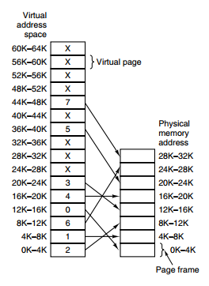

<!-- GFM-TOC -->

* [内存管理](#内存管理)
* [虚拟内存](#虚拟内存)
* [分页系统](#分页系统)
    * [Linux多级页表机制](#Linux多级页表机制)
* [缺页中断](#缺页中断)
* [页面置换算法](#页面置换算法)
    * [1. 最佳](#1-最佳)
    * [2. 最近最久未使用](#2-最近最久未使用)
    * [3. 最近未使用](#3-最近未使用)
    * [4. 先进先出](#4-先进先出)
    * [5. 第二次机会算法](#5-第二次机会算法)
    * [6. 时钟](#6-时钟)
* [分段](#分段)
* [段页式](#段页式)
* [分页与分段的比较](#分页与分段的比较)

<!-- GFM-TOC -->


# 内存管理

在 C++中，虚拟内存分为代码段、数据段、BSS 段、堆区、文件映射区以及栈区六部分。

## 1、栈区

**栈(stack)**：程序**自动分配**，使用栈空间存储函数的返回地址、参数、局部变量、返回值。栈区是从高地址位向低地址位增长的 ， 是一块**连续**的内存区域 ，最大容量是由系统预先定义好的 ， 申请的栈空间超过这个界限时会提示溢出。

## 2、堆区

**堆(heap)**：低地址位向高地址位增长，采用**链式存储**结构。频繁的 `malloc/free` 造成内存空间的不连续，会产生碎片。当申请堆空间时库函数是按照一定的算法搜索可用的足够大的空间。因此堆的效率比栈要低。

- **堆**：调用`malloc` 在堆区动态分配内存，调用 `free` 来手动释放。堆是**操作系统所维护**的一块特殊内存，它提供了动态分配的功能。
- **自由存储区**：由`new` 分配内存，用来 `delete` 手动释放。和堆类似，通过`new`来申请的内存区域可称为自由存储区。

## 3、静态全局区

**静态/全局区**：在 C++ 里面没有区分bss和data。

- **bss段**：存储**未初始化**的全局变量和静态变量（局部+全局），以及所有被**初始化为0**的全局变量和静态变量，Block Started by Symbol。内容并不存放在磁盘上的程序文件中，不占用可执行文件的大小，是由链接器来获取内存的。
- **data段**：存储程序中**已初始化**的全局变量和静态变量。在编译时已经分配了空间，放在程序文件中。

## 4、代码区

**代码区**（code segment 或 text segment）：

大小在程序运行前就已经确定，并且内存区域属于只读。text 段又可以分为

- **代码段**：存放函数体的二进制代码，**text**段。
- **常量区**：只读数据，比如字符串常量，程序结束时由系统释放。**rodata段**，read only。

## 5、映射区

**映射区**：memory mapping segment，存储**动态链接库**等文件映射、申请大内存（malloc 时调用 mmap 函数）


32bitCPU 可寻址 4G 线性空间，每个进程都有各自独立的 4G 逻辑地址，其中 0~3G 是**用户态**空间，3~4G 是**内核**空间，不同进程相同的逻辑地址会映射到不同的物理地址中。其逻辑地址其划分如下：

## 栈空间

C++函数栈空间的最大值默认是 1M，不过可以调整。


# 虚拟内存

虚拟内存的目的是为了防止不同进程同一时刻在**物理内存**中运行而对物理内存的争夺，让物理内存扩充成更大的**逻辑内存**，从而让程序获得更多的可用内存。所有进程**共享**同一物理内存，每个进程只把自己**目前需要的**虚拟内存空间映射并存储到物理内存上，使得不同进程在运行过程中认为自己**独占**了当前系统的 4G 内存。

操作系统将内存抽象成**地址空间**。每个进程有地址空间，地址空间被分割成多个块，每一块称为一**页**。这些页被映射到物理内存，但不需要映射到连续的物理内存，也不需要所有页都必须在物理内存中。

- **创建进程**时，内核为进程分配了虚拟内存，当程序引用到不在物理内存中的页时，才会通过**缺页异常**，将缺失的部分装入物理内存并重新执行失败的指令。
- 进程运行过程中，要**动态分配内存**，比如 `malloc` 时，也分配了虚拟内存，当进程真正访问到此数据时，才引发缺页异常。

请求**分页系统**、请求**分段系统**和请求**段页式系统**都是针对虚拟内存的，通过请求实现内存与外存的信息置换。

## 优点

1. **扩大地址空间**，利用小空间运行大程序；
2. 在程序需要分配连续的内存空间的时候，只需要在虚拟内存空间分配连续空间，而不需要实际物理内存的连续空间，可以**利用碎片**；
3. 内存保护：每个进程运行在各自的虚拟内存地址空间，互相不能干扰对方。虚存还对特定的内存地址提供写保护，可以防止代码或数据被恶意篡改。
4. 当**进程通信**时，可采用虚存共享的方式实现；
5. 当不同的进程使用同样的代码时，比如库文件中的代码，物理内存中可以只存储一份这样的代码，不同的进程只需要把自己的虚拟内存映射过去就可以了，**节省内存**；
6. 虚拟内存很适合在多道程序设计系统中使用，许多程序的片段同时保存在内存中。当一个程序等待它的一部分读入内存时，可以把 CPU 交给另一个进程使用。在内存中可以保留多个进程，系统**并发度提高**；
7. 公平内存分配。采用了虚存之后，每个进程都相当于有同样大小的虚存空间。


## 缺点

1. 虚存的管理需要**建立很多数据结构**，这些数据结构要占用额外的内存
2. 虚拟地址到物理地址的转换，**增加指令**的执行时间。
3. 页面的换入换出需要**磁盘 I/O**，这是很耗时的
4. 如果一页中只有一部分数据，会**浪费内存**。



# 分页系统

当程序引用到不在物理内存中的页时，通过**缺页异常**，将缺失的部分装入物理内存。分页系统用于根据虚拟内存的**地址空间**分配对应的**物理内存**。内存管理单元（memory management unit，MMU）管理着**地址空间**和**物理内存**的转换，其中的页表（Page table）存储着页（程序地址空间）到页框（物理内存空间）的映射表。

一个逻辑地址分成两个部分，高位部分存储**页面号**，低位部分存储**偏移量**。

下图的页表存放着 16 个页，这 16 个页需要用 4 个比特位来进行索引定位。例如对于虚拟地址（0010 000000000100），前 4 位是存储页面号 2，读取表项内容为（110 1），页表项最后一位表示是否存在于内存中，1 表示存在。后 12 位存储偏移量。这个**页对应的页框**的地址为 （110 000000000100）。

<div align="center">  </div><br>

## Linux多级页表机制

linux最新采用四级页表。

PGD： page Global directory(47-39), 页全局目录

PUD： Page Upper Directory(38-30)，页上级目录

PMD： page middle directory(29-21)，页中间目录

PTE： page table entry(20-12)，页表项

### 两级页表

两级分页机制将 32 位的虚拟空间分成三段，低十二位表示页内偏移，高 20 分成两段分别表示两级页表的偏移。

- PGD(Page Global Directory，页全局目录)：最高 10 位，全局页目录表索引
- PTE(Page Table Entry，页表目录)：中间 10 位，页表入口索引

### 三级页表

Linus 新增加了一个层级，叫做**页中间目录(page middle directory, PMD)**, 变成：

| 字段        | 描述                        | 位数           |
| ----------- | --------------------------- | -------------- |
| cr3         | 指向一个 PDPT               | crs 寄存器存储 |
| PGD         | 指向 PDPT 中 4 个项中的一个 | 位 31~30       |
| PMD         | 指向页目录中 512 项中的一个 | 位 29~21       |
| PTE         | 指向页表中 512 项中的一个   | 位 20~12       |
| page offset | 4KB 页中的偏移              | 位 11~0        |

现在就同时存在 2 级页表和 3 级页表，Linux 采取了一种抽象方法：所有架构全部使用 3 级页表，即 PGD -> PMD -> PTE。针对使用 2 级页表的架构，把 PMD 抽象掉，即虚设一个 PMD 表项。这样在 page tablewalk 过程中，PGD 本直接指向 PTE 的，现在不了，指向一个虚拟的 PMD，然后再由 PMD 指向 PTE。这种抽象保持了代码结构的统一。

### 四级页表

64 位 CPU 出现了，它支持 48 位的虚拟地址空间 。如下：

| 字段        | 描述                        | 位数     |
| ----------- | --------------------------- | -------- |
| PML4        | 指向一个 PDPT               | 位 47~39 |
| PGD         | 指向 PDPT 中 4 个项中的一个 | 位 38~30 |
| PMD         | 指向页目录中 512 项中的一个 | 位 29~21 |
| PTE         | 指向页表中 512 项中的一个   | 位 20~12 |
| page offset | 4KB 页中的偏移              | 位 11~0  |

Linux 内核针为使用原来的 3 级列表(PGD->PMD->PTE)，做了折衷。即采用一个唯一的，共享的顶级层次，叫 PML4。这个 PML4 没有编码在地址中，这样就能套用原来的 3 级列表方案了。不过代价就是，由于只有唯一的 PML4, 寻址空间被局限在512G，而本来 PML4 段有 9 位,可以支持 512 个 PML4 表项的。现在为了使用 3 级列表方案，只能限制使用一个。

引入PUD： Page Upper Directory(38-30)，页上级目录

4 级页表分别是：PGD -> PUD -> PMD -> PTE。


# 缺页中断

`malloc()`和 `mmap()`等内存分配函数，在分配时只是建立了进程虚拟**地址空间**，并没有分配虚拟内存对应的**物理内存**。当进程访问这些没有建立映射关系的虚拟内存时，处理器自动触发一个**缺页异常**。

缺页中断：在请求**分页系统**中，可以通过查询页表中的状态位来确定所要访问的页面是否存在于内存中。每当所要访问的**页面不在内存**时，会产生一次缺页中断，此时操作系统会根据页表中的**外存地址**在外存中找到所缺的一页，将其调入内存。

缺页本身是一种中断，与一般的中断一样，需要经过 4 个处理步骤：

1. 保护 CPU 现场
2. 分析中断原因
3. 转入**缺页中断处理程序**进行处理
4. 恢复 CPU 现场，继续执行

但是缺页中断是由于所要访问的页面不存在于内存时，由硬件所产生的一种特殊的中断，因此，与一般的中断存在区别：

1. 在指令执行期间产生和处理缺页中断信号
2. 一条指令在执行期间，可能产生多次缺页中断
3. 缺页中断返回是，执行产生中断的一条指令，而一般的中断返回是，执行下一条指令。


# 页面置换算法

在程序运行过程中，如果要访问的页面不在内存中，就发生缺页中断从而将该页调入内存中。此时如果内存已无空闲空间，系统必须从内存中调出一个页面到磁盘对换区中来腾出空间。

页面置换算法和缓存淘汰策略类似，可以将内存看成磁盘的缓存。在缓存系统中，缓存的大小有限，当有新的缓存到达时，需要淘汰一部分已经存在的缓存，这样才有空间存放新的缓存数据。

页面置换算法的主要目标是使页面置换频率最低（也可以说缺页率最低）。

## 1. 最佳

> OPT, Optimal replacement algorithm 最佳替换算法

所选择的被换出的页面将是最长时间内不再被访问，通常可以保证获得最低的缺页率。

是一种理论上的算法，因为无法知道一个页面多长时间不再被访问。

举例：一个系统为某进程分配了三个物理块，并有如下页面引用序列：

```html
7，0，1，2，0，3，0，4，2，3，0，3，2，1，2，0，1，7，0，1
```

开始运行时，先将 7, 0, 1 三个页面装入内存。当进程要访问页面 2 时，产生缺页中断，会将页面 7 换出，因为页面 7 再次被访问的时间最长。

## 2. 最近最久未使用

> LRU, Least Recently Used

虽然无法知道将来要使用的页面情况，但是可以知道过去使用页面的情况。LRU 将最近最久未使用的页面换出。

为了实现 LRU，需要在内存中维护一个**所有页面的链表**。当一个页面被访问时，将这个页面移到链表表头。这样就能保证链表表尾的页面是最近最久未访问的。

因为每次访问都需要更新链表，因此这种方式实现的 LRU 代价很高。

```html
4，7，0，7，1，0，1，2，1，2，6
```

<div align="center">  </div><br>
## 3. 最近未使用

> NRU, Not Recently Used

每个页面都有两个状态位：R 与 M，当页面被访问时设置页面的 R=1，当页面被修改时设置 M=1。其中 R 位会定时被清零。可以将页面分成以下四类：

- R=0，M=0
- R=0，M=1
- R=1，M=0
- R=1，M=1

当发生缺页中断时，NRU 算法随机地从类编号最小的非空类中挑选一个页面将它换出。

NRU 优先换出**已经被修改的**脏页面（R=0，M=1），而不是被频繁使用的干净页面（R=1，M=0）。

## 4. 先进先出

> FIFO, First In First Out

选择换出的页面是最先进入的页面。

该算法会将那些经常被访问的页面换出，导致缺页率升高。

## 5. 第二次机会算法

FIFO 算法可能会把经常使用的页面置换出去，为了避免这一问题，对该算法做一个简单的修改：

当页面被访问 (读或写) 时设置该页面的 R 位为 1。需要替换的时候，检查最老页面的 R 位。如果 R 位是 0，那么这个页面既老又没有被使用，可以立刻置换掉；如果是 1，就将 R 位清 0，并把该页面放到链表的尾端，修改它的装入时间使它就像刚装入的一样，然后继续从链表的头部开始搜索。

<div align="center">  </div><br>

## 6. 时钟

> Clock

第二次机会算法需要在链表中移动页面，降低了效率。时钟算法使用环形链表将页面连接起来，再使用一个指针指向最老的页面。

<div align="center">  </div><br>

# 分段

虚拟内存采用的是分页技术，也就是将地址空间划分成固定大小的页，每一页再与内存进行映射。

下图为一个编译器在编译过程中建立的多个表，有 4 个表是动态增长的，如果使用分页系统的一维地址空间，动态增长的特点会导致覆盖问题的出现。

<div align="center">  </div><br>

分段的做法是把每个表分成段，**一个段构成一个独立的地址空间**。每个段的长度可以不同，并且可以**动态增长**。

<div align="center">  </div><br>

# 段页式

程序的地址空间划分成多个拥有独立地址空间的段，每个段上的地址空间划分成大小相同的页。这样既拥有分段系统的共享和保护，又拥有分页系统的虚拟内存功能。

# 分页与分段的比较

- 对程序员的透明性：分页透明，但是分段需要程序员显式划分每个段。

- 地址空间的维度：分页是一维地址空间，分段是二维的。

- 大小是否可以改变：页的大小不可变，段的大小可以动态改变。

- 出现的原因：分页主要用于实现虚拟内存，从而获得更大的地址空间；分段主要是为了使程序和数据可以被划分为逻辑上独立的地址空间并且有助于共享和保护。


